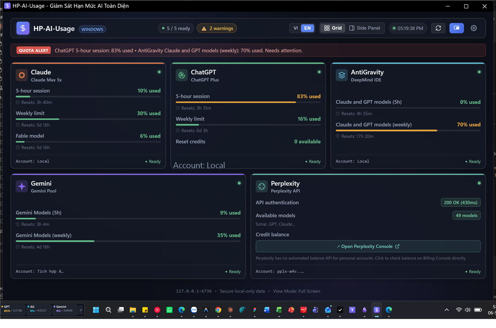
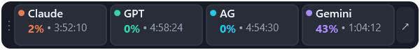
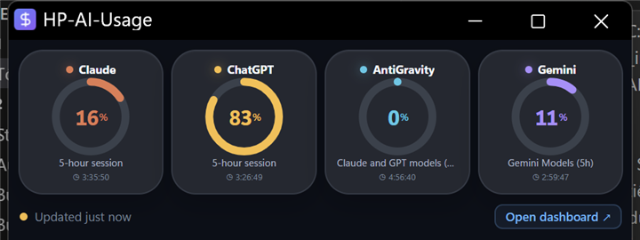
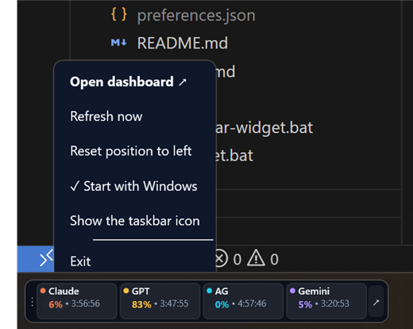

# HP-AI-Usage

A local, zero-dependency dashboard for Windows that tracks the usage quotas of four AI providers side by side: Anthropic Claude, OpenAI ChatGPT/Codex, Google AntiGravity, and Google Gemini.

[English](#english) · [Tiếng Việt](#tiếng-việt)



The always-on-top taskbar mini-bar with live reset countdowns:



<table>
<tr>
<td width="50%"><br><sub>Floating widget with quota rings</sub></td>
<td width="50%"><br><sub>Taskbar right-click menu</sub></td>
</tr>
</table>

---

## English

### What it does

HP-AI-Usage reads the credentials already stored on your machine by the AI tools you use, then shows how much of each quota window is left, all in one place. There is no separate login and nothing leaves your computer except the requests to each provider's own servers.

- **Anthropic Claude**: 5-hour session window, 7-day weekly window, and per-model sub-limits. The subscription tier (for example Claude Max 5x) is read from your real account, not hard-coded.
- **OpenAI ChatGPT / Codex**: 5-hour session window, 7-day weekly window, plan name, and reset credits.
- **Google AntiGravity**: connects to the AntiGravity IDE local language server to read the Claude and GPT model group quotas.
- **Google Gemini**: the Gemini model group quotas, also via AntiGravity IDE.

### Highlights

- **No re-login.** Reads the existing sessions of Claude Code (`~/.claude/.credentials.json`), Codex CLI (`~/.codex/auth.json`) and AntiGravity IDE.
- **Local only.** The server listens on `http://127.0.0.1:6736` and never sends your account data anywhere else.
- **Zero external dependencies.** The server uses only the Node.js standard library.
- **Three surfaces:**
  - **Full dashboard** with a responsive card grid and a narrow side-panel mode to dock next to your IDE.
  - **Floating widget** showing four provider tiles as quota rings; click a tile for details.
  - **Taskbar mini-bar**, an always-on-top app that sits on the Windows taskbar with four compact pills and live reset countdowns.
- **Bilingual (English / Vietnamese)** with a toggle in the navigation bar; the choice is remembered.
- **Live updates.** The server pushes data over Server-Sent Events as soon as each provider finishes scanning, instead of waiting for the slowest one.

### Security and terms, please read

This tool reads local credential files (`~/.claude/.credentials.json`, `~/.codex/auth.json`) and the CSRF token from the AntiGravity IDE process command line. Access tokens are sent only to each provider's own server, and the local server binds to `127.0.0.1` only. Even so, read the source before running it. That is the right habit for any tool that touches your login credentials.

The Anthropic and OpenAI quota endpoints used here are **private, undocumented APIs**. They can change or stop working at any time, and automated access may not be consistent with the providers' terms of service. Use at your own risk. The project keeps request counts low with caching and rate-limit backoff.

This project is not affiliated with Anthropic, OpenAI, or Google.

### Prerequisites (Mandatory for Claude & ChatGPT)

HP-AI-Usage **does not read quotas from web browser sessions** (`claude.ai` or `chatgpt.com`). Instead, it reads the local session files generated by official developer CLI tools. To display your Claude and ChatGPT quotas, you **must** complete these authentication steps:

1. **Anthropic Claude (Required for Claude)**:
   - Install the official Claude Code CLI:
     ```bash
     npm install -g @anthropic-ai/claude-code
     ```
   - Authenticate your account:
     ```bash
     claude
     ```
     (This opens your browser to authorize; your session is saved to `~/.claude/.credentials.json`).

2. **OpenAI ChatGPT / Codex (Required for ChatGPT)**:
   - Install and authenticate Codex CLI:
     ```bash
     codex login
     ```
     (This saves your session to `~/.codex/auth.json`).

3. **Google AntiGravity & Gemini**:
   - Keep the AntiGravity IDE application open while using the dashboard.

### Getting started

Double-click `start.bat`, or run:

```bash
npm start
```

Then open `http://127.0.0.1:6736`.

**Desktop shortcuts**
- `cai-dat-shortcut-desktop.bat` creates a shortcut that opens the dashboard as a standalone app window.
- `cai-dat-shortcut-widget.bat` creates a shortcut for the floating widget.
- `cai-dat-shortcut-taskbar.bat` creates a shortcut for the taskbar mini-bar.

**Taskbar mini-bar**

Run `start-taskbar-widget.bat` or launch `HP-AI-Usage.exe`.
- Drag the `⋮` grip on the left to move it.
- Click a pill or the `↗` button to open the full dashboard.
- Right-click for the menu: open dashboard, refresh now, reset position, show/hide the taskbar icon, exit.
- When a value cannot be read, the pill shows a grey `--%` instead of keeping a stale number.

### Rebuilding the taskbar app

The mini-bar is a WPF app written in C# (`AppTaskbar.cs`). After editing the source, rebuild for changes to take effect:

```bat
build.bat
```

If the bar is running, its executable is locked, so the script stops and asks you to close it first. To close and rebuild in one step:

```bat
build.bat /force
```

The script uses the `csc.exe` compiler from the .NET Framework 4.x that ships with Windows, builds to a temporary file before replacing the target, and always keeps a `HP-AI-Usage.exe.bak` backup.

### Optional configuration

Copy `.env.example` to `.env` and fill in your keys:

```env
PORT=6736
GEMINI_API_KEY=
```

Or click the gear icon in the top-right of the dashboard. Saving through the UI preserves every comment and other variable already in `.env`.

`GEMINI_API_KEY` is **not used yet**: Gemini quotas are read through AntiGravity IDE. The field only stores the key for a future extension.

### Testing

```bash
npm test              # UI data model and the i18n dictionary
npm run test:scanners # data contract of the four scanners, makes real network calls
```

### Requirements

- Windows 10 or Windows 11
- Node.js 18 or newer
- .NET Framework 4.x (ships with Windows) only if you want to rebuild the taskbar app
- No external packages to install

### License

MIT. See [LICENSE](LICENSE).

---

## Tiếng Việt

Màn hình tổng hợp cục bộ trên Windows, không phụ thuộc thư viện ngoài, theo dõi hạn mức sử dụng (usage quota) của bốn nhà cung cấp trí tuệ nhân tạo (AI) cùng lúc: Anthropic Claude, OpenAI ChatGPT/Codex, Google AntiGravity và Google Gemini.

### Công cụ này làm gì

HP-AI-Usage đọc thông tin xác thực (credentials) có sẵn trên máy của các công cụ AI bạn đang dùng, rồi hiển thị mỗi cửa sổ hạn mức còn lại bao nhiêu, tất cả ở một chỗ. Không cần đăng nhập riêng, và không có gì rời khỏi máy tính ngoài các yêu cầu gửi tới chính máy chủ của từng nhà cung cấp.

- **Anthropic Claude:** hạn mức phiên 5 giờ, hạn mức tuần 7 ngày, và các mô hình con. Tên gói cước (ví dụ Claude Max 5x) được đọc từ tài khoản thật, không ghi cứng.
- **OpenAI ChatGPT / Codex:** hạn mức phiên 5 giờ, hạn mức tuần 7 ngày, tên gói, và số lượt khôi phục hạn mức (reset credits).
- **Google AntiGravity:** kết nối máy chủ ngôn ngữ nội bộ (local language server) của AntiGravity IDE để đọc hạn mức nhóm mô hình Claude và GPT.
- **Google Gemini:** hạn mức nhóm mô hình Gemini, cũng qua AntiGravity IDE.

### Điểm nổi bật

- **Không cần đăng nhập lại:** đọc phiên có sẵn của Claude Code (`~/.claude/.credentials.json`), Codex CLI (`~/.codex/auth.json`) và AntiGravity IDE.
- **Chỉ chạy cục bộ:** máy chủ chỉ lắng nghe trên `http://127.0.0.1:6736`, không gửi dữ liệu tài khoản đi đâu khác.
- **Không phụ thuộc thư viện ngoài:** phần máy chủ chỉ dùng thư viện chuẩn của Node.js.
- **Ba dạng hiển thị:**
  - **Màn hình tổng hợp đầy đủ:** lưới thẻ tự co giãn, kèm chế độ Bảng bên (side panel) hẹp để ghim cạnh IDE.
  - **Tiện ích thu nhỏ (widget):** bốn ô dịch vụ dạng vòng hạn mức, bấm vào một ô để xem chi tiết.
  - **Thanh ngang trên thanh tác vụ (taskbar):** ứng dụng luôn nằm trên cùng, bốn viên thuốc gọn kèm đồng hồ đếm ngược tới lúc đặt lại.
  - **Song ngữ Việt và Anh:** nút chuyển đổi trên thanh điều hướng, có ghi nhớ lựa chọn.
- **Cập nhật trực tiếp:** máy chủ đẩy dữ liệu qua luồng sự kiện (Server-Sent Events) ngay khi từng nguồn quét xong, không chờ nguồn chậm nhất.

### Bảo mật và điều khoản, cần đọc

Công cụ đọc các tệp thông tin xác thực cục bộ (`~/.claude/.credentials.json`, `~/.codex/auth.json`) và mã chống giả mạo yêu cầu (CSRF token) trên dòng lệnh của tiến trình AntiGravity IDE. Mã truy cập chỉ được gửi tới đúng máy chủ của nhà cung cấp tương ứng, và máy chủ cục bộ chỉ lắng nghe trên `127.0.0.1`. Dù vậy, hãy tự đọc mã nguồn trước khi chạy. Đây là thói quen đúng với mọi công cụ chạm vào thông tin đăng nhập của bạn.

Hai điểm cuối lấy hạn mức của Anthropic và OpenAI là **giao diện nội bộ không được công bố**. Chúng có thể thay đổi hoặc ngừng hoạt động bất cứ lúc nào, và việc truy cập tự động có thể không phù hợp với điều khoản sử dụng của nhà cung cấp. Bạn tự chịu trách nhiệm khi sử dụng. Dự án đã đặt bộ nhớ đệm và cơ chế lùi khi bị giới hạn tần suất để giữ số lượt gọi ở mức thấp.

Dự án không có liên kết với Anthropic, OpenAI hay Google.

### Điều kiện bắt buộc (Kiểm tra và cài đặt trước)

HP-AI-Usage **không đọc dữ liệu từ phiên duyệt web** (`claude.ai` hay `chatgpt.com`). Công cụ đọc trực tiếp từ tệp phiên đăng nhập của các công cụ giao diện dòng lệnh (CLI - Command Line Interface) chính thức dành cho lập trình viên. Để màn hình tổng hợp hiển thị số liệu hạn mức Claude và ChatGPT, bạn **bắt buộc** phải thực hiện các bước sau:

1. **Anthropic Claude (Bắt buộc để theo dõi Claude):**
   - Cài đặt công cụ dòng lệnh Claude Code:
     ```bash
     npm install -g @anthropic-ai/claude-code
     ```
   - Đăng nhập tài khoản của bạn:
     ```bash
     claude
     ```
     (Trình duyệt sẽ mở ra để bạn cấp quyền đăng nhập, tệp phiên `%USERPROFILE%\.claude\.credentials.json` sẽ tự động được lưu trên máy tính).

2. **OpenAI ChatGPT / Codex (Bắt buộc để theo dõi ChatGPT):**
   - Cài đặt và đăng nhập công cụ dòng lệnh Codex CLI:
     ```bash
     codex login
     ```
     (Lệnh này sẽ tạo tệp phiên đăng nhập `%USERPROFILE%\.codex\auth.json`).

3. **Google AntiGravity và Gemini:**
   - Mở sẵn ứng dụng AntiGravity IDE trên máy tính.

### Bắt đầu

Nhấp đúp `start.bat`, hoặc chạy:

```bash
npm start
```

Rồi mở `http://127.0.0.1:6736`.

**Lối tắt trên màn hình**
- `cai-dat-shortcut-desktop.bat` tạo lối tắt mở màn hình tổng hợp như ứng dụng độc lập.
- `cai-dat-shortcut-widget.bat` tạo lối tắt mở tiện ích thu nhỏ.
- `cai-dat-shortcut-taskbar.bat` tạo lối tắt mở thanh ngang trên thanh tác vụ.

**Thanh ngang trên thanh tác vụ**

Chạy `start-taskbar-widget.bat` hoặc mở `HP-AI-Usage.exe`.
- Kéo tay cầm `⋮` bên trái để di chuyển.
- Nhấp một viên thuốc hoặc nút `↗` để mở màn hình tổng hợp đầy đủ.
- Nhấp chuột phải để mở menu: mở màn hình tổng hợp, cập nhật ngay, đặt lại vị trí, ẩn hoặc hiện biểu tượng trên thanh tác vụ, thoát.
- Khi không đọc được số liệu, viên thuốc hiện `--%` màu xám thay vì giữ con số cũ.

### Biên dịch lại thanh tác vụ

Thanh ngang là ứng dụng WPF viết bằng C# (`AppTaskbar.cs`). Sau khi sửa mã nguồn phải biên dịch lại thì thay đổi mới có tác dụng:

```bat
build.bat
```

Nếu thanh đang chạy, tệp thực thi bị khóa nên script sẽ dừng và nhắc đóng thanh trước. Muốn tự đóng rồi biên dịch luôn:

```bat
build.bat /force
```

Script dùng trình biên dịch `csc.exe` của .NET Framework 4.x có sẵn trong Windows, biên dịch ra tệp tạm rồi mới thay thế, và luôn giữ một bản sao lưu `HP-AI-Usage.exe.bak`.

### Cấu hình bổ sung

Sao chép `.env.example` thành `.env` rồi điền khóa:

```env
PORT=6736
GEMINI_API_KEY=
```

Hoặc bấm biểu tượng bánh răng ở góc trên bên phải giao diện. Việc lưu qua giao diện sẽ giữ nguyên mọi dòng chú thích và biến khác trong tệp `.env`.

`GEMINI_API_KEY` hiện **chưa được sử dụng**: hạn mức Gemini đang đọc qua AntiGravity IDE. Ô nhập chỉ lưu sẵn khóa cho lần mở rộng sau.

### Kiểm thử

```bash
npm test              # mô hình dữ liệu giao diện và bộ chuyển ngữ
npm run test:scanners # hợp đồng dữ liệu của bốn bộ quét, có gọi mạng thật
```

### Yêu cầu hệ thống

- Windows 10 hoặc Windows 11
- Node.js phiên bản 18 trở lên
- .NET Framework 4.x (kèm sẵn trong Windows) nếu muốn biên dịch lại thanh tác vụ
- Không cần cài thêm thư viện ngoài

### Giấy phép

MIT. Xem [LICENSE](LICENSE).
